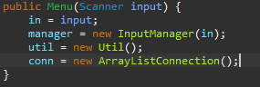
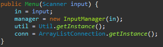
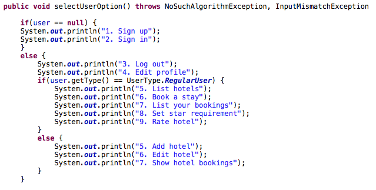

# Refactored version of the java hotel management software.

## Patterns applied:
### 1.  Singleton:
 Limit the program to use only one instance (prohibit instantiation) of the database connection class, to avoid data inconsistency, also prohibit instantiation of Util class, to avoid unecessary memory allocation.
### Before:
 
### After:
 
### 2. Extract method:
 Group consecutive commands on a separate method
### Before:
 
### After:
 
